# README.md - Aufgabe 5: Big Data Stream Processing

## Zielsetzung

Implementation einer horizontalen skalierbaren Stream-Processing-Pipeline auf der bestehenden Multi-Node-Kubernetes-Infrastruktur mit Apache Kafka Streams als zentrale Processing-Engine. Die Lösung demonstriert Big Data Stream Processing mit ML-enhanced Real-time Anomaly Detection für Sensor- und User-Event-Daten.

## Technologie-Auswahl und Begründung

### Stream-Processing-Engine: Apache Kafka Streams

**Begründung der Technologiewahl:**

Apache Kafka Streams wurde als Stream-Processing-Engine ausgewählt gegenüber Alternativen wie Apache Flink oder Spark Streaming aus folgenden technischen Gründen:

- **Native Kafka Integration**: Keine separaten Cluster erforderlich, direkte Integration in die bestehende Kafka-Infrastruktur
- **Exactly-once Processing Semantics**: Garantierte Nachrichtenverarbeitung ohne Datenverlust oder Duplikate
- **Automatische Consumer Group Coordination**: Built-in Partition-Assignment und Rebalancing bei horizontaler Skalierung
- **Low Operational Overhead**: Läuft als Standard Java-Anwendung in Kubernetes ohne zusätzliche Resource Manager
- **Stateful Stream Processing**: Built-in State Stores für komplexe Aggregationen und Joins

### Message Broker: Apache Kafka

**Begründung für Kafka-Cluster-Design:**

- **Single-Broker Setup**: Optimiert für Demonstrationszwecke mit begrenzten Ressourcen
- **Multi-Partition Topics**: Ermöglicht horizontale Parallelisierung der Stream Processing
- **Confluent Platform**: Stabile, production-ready Distribution mit umfassendem Tooling

### Container-Orchestrierung: Kubernetes (K3s)

- **Horizontal Pod Autoscaler**: Automatische Skalierung basierend auf CPU/Memory Metriken
- **Resource Management**: Definierte Limits und Requests für vorhersagbare Performance
- **Service Discovery**: Native Kubernetes DNS für Service-to-Service Kommunikation

## Systemarchitektur



## Horizontale Skalierbarkeit Implementation

### Consumer Group Partitioning

Die horizontale Skalierbarkeit wird durch Kafka Streams Consumer Groups realisiert. Jeder Stream-Processor Pod fungiert als Consumer-Instance:

```java
// Automatische Partition-Assignment durch Kafka Streams
Properties props = new Properties();
props.put(StreamsConfig.APPLICATION_ID_CONFIG, "sensor-anomaly-detector");
props.put(StreamsConfig.NUM_STREAM_THREADS_CONFIG, 1);

// Consumer Group Coordination erfolgt automatisch
KafkaStreams streams = new KafkaStreams(builder.build(), props);
streams.start();
```

### Kubernetes Horizontal Pod Autoscaler

```yaml
apiVersion: autoscaling/v2
kind: HorizontalPodAutoscaler
metadata:
  name: kafka-streams-processor-hpa
  namespace: kafka
spec:
  scaleTargetRef:
    apiVersion: apps/v1
    kind: Deployment
    name: kafka-streams-anomaly-processor
  minReplicas: 1
  maxReplicas: 3
  metrics:
  - type: Resource
    resource:
      name: cpu
      target:
        type: Utilization
        averageUtilization: 70
```

## Stream Processing Implementation

### Kafka Streams Application Architecture

Die Stream Processing Logik ist implementiert in `SensorAnomalyProcessor.java`:

```java
public static void main(String[] args) {
    Properties props = new Properties();
    props.put(StreamsConfig.APPLICATION_ID_CONFIG, "sensor-anomaly-detector");
    props.put(StreamsConfig.BOOTSTRAP_SERVERS_CONFIG, 
             System.getenv().getOrDefault("KAFKA_BOOTSTRAP_SERVERS", "kafka-headless:9092"));
    props.put(StreamsConfig.PROCESSING_GUARANTEE_CONFIG, StreamsConfig.AT_LEAST_ONCE);
    
    StreamsBuilder builder = new StreamsBuilder();
    
    // Sensor Data Stream Processing
    KStream<String, String> sensorData = builder.stream("sensor-data");
    sensorData
        .mapValues(SensorAnomalyProcessor::processSensorData)
        .filter((key, value) -> value != null)
        .to("ml-predictions", Produced.with(Serdes.String(), Serdes.String()));
    
    // User Events Stream Processing
    KStream<String, String> userEvents = builder.stream("user-events");
    userEvents
        .mapValues(SensorAnomalyProcessor::processUserEvent)
        .filter((key, value) -> value != null)
        .to("ml-predictions", Produced.with(Serdes.String(), Serdes.String()));
    
    KafkaStreams streams = new KafkaStreams(builder.build(), props);
    streams.start();
}
```

### ML-Enhanced Anomaly Detection Algorithm

Die Anomalie-Erkennung implementiert Threshold-basierte Regeln mit Scoring-System:

```java
private static String processSensorData(String jsonValue) {
    try {
        JsonNode sensor = objectMapper.readTree(jsonValue);
        
        double temperature = sensor.get("temperature").asDouble();
        double humidity = sensor.get("humidity").asDouble();
        String sensorId = sensor.get("sensor_id").asText();
        
        int anomalyScore = 0;
        String alertLevel = "NORMAL";
        StringBuilder anomalyReasons = new StringBuilder("[");
        
        // Temperature Threshold Analysis
        if (temperature > 35) {
            anomalyScore += 3;
            alertLevel = "CRITICAL";
            anomalyReasons.append("\"HIGH_TEMPERATURE\"");
        } else if (temperature < 5) {
            anomalyScore += 3;
            alertLevel = "CRITICAL";
            anomalyReasons.append("\"LOW_TEMPERATURE\"");
        } else if (temperature > 30 || temperature < 10) {
            anomalyScore += 1;
            alertLevel = "WARNING";
            anomalyReasons.append("\"TEMP_WARNING\"");
        }
        
        // Humidity Threshold Analysis
        if (humidity > 85) {
            anomalyScore += 2;
            if ("NORMAL".equals(alertLevel)) alertLevel = "WARNING";
            if (anomalyReasons.length() > 1) anomalyReasons.append(",");
            anomalyReasons.append("\"HIGH_HUMIDITY\"");
        }
        
        anomalyReasons.append("]");
        
        if (anomalyScore > 0) {
            // Create ML Prediction Result
            ObjectNode result = objectMapper.createObjectNode();
            result.put("timestamp", Instant.now().toString());
            result.put("processor", "kafka-streams");
            result.put("ml_model", "threshold-anomaly-detector-v1.0");
            result.put("sensor_id", sensorId);
            result.put("temperature", temperature);
            result.put("humidity", humidity);
            result.put("ml_prediction", anomalyScore > 2 ? "ANOMALY_DETECTED" : "WARNING_DETECTED");
            result.put("alert_level", alertLevel);
            result.put("anomaly_score", anomalyScore);
            result.put("anomaly_reasons", anomalyReasons.toString());
            
            return objectMapper.writeValueAsString(result);
        }
        return null; // Filter out normal readings
        
    } catch (Exception e) {
        System.err.println("Error processing sensor data: " + e.getMessage());
        return null;
    }
}
```

## Build System und Deployment

### Maven Multi-Module Build

```xml
<project xmlns="http://maven.apache.org/POM/4.0.0">
    <modelVersion>4.0.0</modelVersion>
    <groupId>com.sensor.anomaly</groupId>
    <artifactId>sensor-anomaly-processor</artifactId>
    <version>1.0.0</version>
    <packaging>jar</packaging>
    
    <dependencies>
        <dependency>
            <groupId>org.apache.kafka</groupId>
            <artifactId>kafka-streams</artifactId>
            <version>3.5.1</version>
        </dependency>
        <dependency>
            <groupId>com.fasterxml.jackson.core</groupId>
            <artifactId>jackson-databind</artifactId>
            <version>2.15.2</version>
        </dependency>
    </dependencies>
    
    <build>
        <plugins>
            <plugin>
                <groupId>org.apache.maven.plugins</groupId>
                <artifactId>maven-shade-plugin</artifactId>
                <version>3.4.1</version>
                <executions>
                    <execution>
                        <phase>package</phase>
                        <goals>
                            <goal>shade</goal>
                        </goals>
                        <configuration>
                            <transformers>
                                <transformer implementation="org.apache.maven.plugins.shade.resource.ManifestResourceTransformer">
                                    <mainClass>com.sensor.anomaly.SensorAnomalyProcessor</mainClass>
                                </transformer>
                            </transformers>
                        </configuration>
                    </execution>
                </executions>
            </plugin>
        </plugins>
    </build>
</project>
```

### Docker Multi-Stage Build

```dockerfile
FROM maven:3.8-openjdk-11-slim AS builder
WORKDIR /app
COPY pom.xml .
RUN mvn dependency:go-offline -B
COPY src ./src
RUN mvn clean package -DskipTests -B

FROM openjdk:11-jre-slim
WORKDIR /app
RUN groupadd -r kafkastreams && useradd -r -g kafkastreams kafkastreams
USER kafkastreams
COPY --from=builder /app/target/sensor-anomaly-processor-1.0.0.jar app.jar
EXPOSE 9999
CMD ["sh", "-c", "java $JAVA_OPTS $KAFKA_STREAMS_OPTS -jar app.jar"]
```

### Kubernetes Deployment Configuration

```yaml
apiVersion: apps/v1
kind: Deployment
metadata:
  name: kafka-streams-anomaly-processor
  namespace: kafka
  labels:
    app: kafka-streams-processor
    version: v1.0.0
spec:
  replicas: 1
  selector:
    matchLabels:
      app: kafka-streams-processor
  template:
    metadata:
      labels:
        app: kafka-streams-processor
        version: v1.0.0
    spec:
      containers:
      - name: kafka-streams-processor
        image: sensor-anomaly-processor:1.0.0
        imagePullPolicy: Never
        env:
        - name: KAFKA_BOOTSTRAP_SERVERS
          value: "kafka-headless:9092"
        - name: KAFKA_APPLICATION_ID
          value: "sensor-anomaly-detector"
        - name: JAVA_OPTS
          value: "-Xmx512m -Xms256m -XX:+UseContainerSupport"
        - name: KAFKA_STREAMS_OPTS
          value: "-Dkafka.streams.auto.offset.reset=earliest -Dkafka.streams.processing.guarantee=exactly_once_v2"
        resources:
          requests:
            memory: "512Mi"
            cpu: "300m"
          limits:
            memory: "768Mi"
            cpu: "600m"
        securityContext:
          runAsNonRoot: true
          runAsUser: 1001
          runAsGroup: 1001
          allowPrivilegeEscalation: false
          readOnlyRootFilesystem: false
```

## Installation und Betrieb

### Vollständiger Deployment Workflow

```bash
# 1. Infrastructure Deployment
./version-manager.sh deploy v1.0

# 2. Kafka Cluster Installation
./version-manager.sh setup-kafka

# 3. Java Application Build & Deployment
./version-manager.sh deploy-ml-stream-processor

# 4. Monitoring UI Setup
./version-manager.sh deploy-kafka-ui
```

### Demo und Testing

```bash
# Demo Preparation
./version-manager.sh demo-ready-check
./version-manager.sh setup-autoscaling

# Stream Processing Demo
./version-manager.sh kafka-stream-demo

# Horizontal Scaling Test
./version-manager.sh trigger-intensive-load-test
./version-manager.sh scaling-monitor

# Cleanup
./version-manager.sh cleanup-load-tests
```

### Monitoring und Status

```bash
# System Status
./version-manager.sh kafka-status
./version-manager.sh stream-status
./version-manager.sh hpa-status

# Data Flow Analysis
./version-manager.sh show-data-flow
./version-manager.sh kafka-show-streams
```

## Performance und Skalierbarkeit

### Horizontal Scaling Characteristics

- **Minimum Pods**: 1 Instance (Baseline)
- **Maximum Pods**: 3 Instances (Resource-Limited)
- **Scaling Trigger**: 70% CPU Utilization (Production) / 3% (Demo)
- **Partition Distribution**: Automatisch durch Kafka Consumer Group Protocol
- **Processing Throughput**: ~1000 Messages/Minute pro Pod

### Resource Allocation

```yaml
resources:
  requests:
    memory: "512Mi"
    cpu: "300m"
  limits:
    memory: "768Mi" 
    cpu: "600m"
```

### Topic Partition Strategy

- **sensor-data**: 9 Partitions (High-Volume Sensor Data)
- **user-events**: 6 Partitions (Medium-Volume User Interactions)  
- **ml-predictions**: 3 Partitions (Low-Volume Anomaly Results)

## Architektur-Entscheidungen und Begründungen

### Single-Broker Kafka Setup

**Entscheidung**: Ein Kafka Broker statt Multi-Broker Cluster

**Begründung**: 
- Resource-Optimierung für Demonstrationszwecke
- Vereinfachte Konfiguration und Debugging
- Ausreichend für Proof-of-Concept der horizontalen Stream Processing Skalierbarkeit
- Replication Factor 1 reduziert Storage-Overhead

### Master-Node Pod Placement

**Entscheidung**: Stream Processors laufen auf Master Node

**Begründung**:
- Garantierte Ressourcenverfügbarkeit
- Vereinfachte Image Distribution 
- Vermeidung von Worker-Node Netzwerk-Latenz zu Kafka
- Stabile Performance für Demo-Zwecke

### Exactly-Once vs At-Least-Once Processing

**Entscheidung**: At-Least-Once Processing Guarantee

**Begründung**:
- Reduzierter Overhead gegenüber Exactly-Once
- Ausreichend für Anomaly Detection Use Case
- Einfachere Konfiguration und Debugging
- Höhere Throughput Performance

## Erfüllte Anforderungen

### Aufgabenstellung Compliance

1. **Kafka-Cluster Installation**: Vollständig implementiert mit Zookeeper Coordination
2. **Stream-Processing-Engine**: Apache Kafka Streams als Java-Library implementiert  
3. **Horizontale Skalierbarkeit**: HPA mit automatischem Consumer Group Rebalancing
4. **Datenverarbeitung**: ML-Enhanced Anomaly Detection für gestreamte Sensor-Daten
5. **Architektur-Dokumentation**: Detaillierte Systemarchitektur und Konfiguration
6. **Skalierungsmechanismen**: Kubernetes HPA mit CPU/Memory-basierten Metriken

### Bonus-Features

- **Java-basierte Enterprise-Grade Implementation**: Statt Shell-Script-basierte Lösung
- **Moderne Web-UI**: Kafka-UI für grafisches Monitoring
- **Production-Ready Security**: Non-Root Container mit Security Context
- **Comprehensive Tooling**: Vollständig automatisierte Deployment- und Demo-Scripts

## Technische Herausforderungen und Lösungen

### Challenge: Container Image Distribution

**Problem**: Kafka Streams Image muss auf alle Kubernetes Nodes verfügbar sein

**Lösung**: 
```bash
# Automatische Image-Distribution im deployment script
for NODE_IP in $NODE_IPS; do
    scp /tmp/sensor-anomaly-processor.tar ubuntu@$NODE_IP:/tmp/
    ssh ubuntu@$NODE_IP 'sudo k3s ctr images import /tmp/sensor-anomaly-processor.tar'
done
```

### Challenge: HPA Configuration für Demo

**Problem**: Production HPA Thresholds (70% CPU) zu hoch für Demo-Szenario

**Lösung**: Demo-spezifische HPA Konfiguration mit automatischem Reset
```bash
fix_hpa_config() {
    kubectl patch hpa kafka-streams-processor-hpa -n kafka -p '{"spec":{"metrics":[{"type":"Resource","resource":{"name":"cpu","target":{"type":"Utilization","averageUtilization":3}}}]}}'
}
```

### Challenge: Load Generation für Scaling

**Problem**: Realistische Load Generation für Horizontal Scaling Demo

**Lösung**: Multi-threaded Load Test mit konfigurierbarer Message-Rate
```yaml
# Intensive Load Test Configuration
for i in {1..500}; do
    for k in {1..5}; do
        # Generate CPU-intensive sensor data
        echo "$JSON_MESSAGE" | kafka-console-producer --bootstrap-server kafka-headless:9092 --topic sensor-data &
    done
    sleep 0.05  # High-frequency generation
done
```